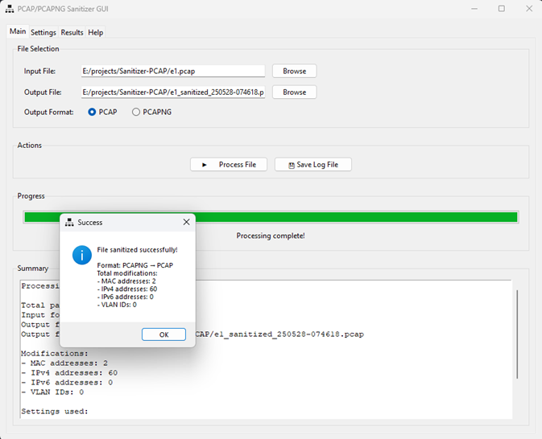
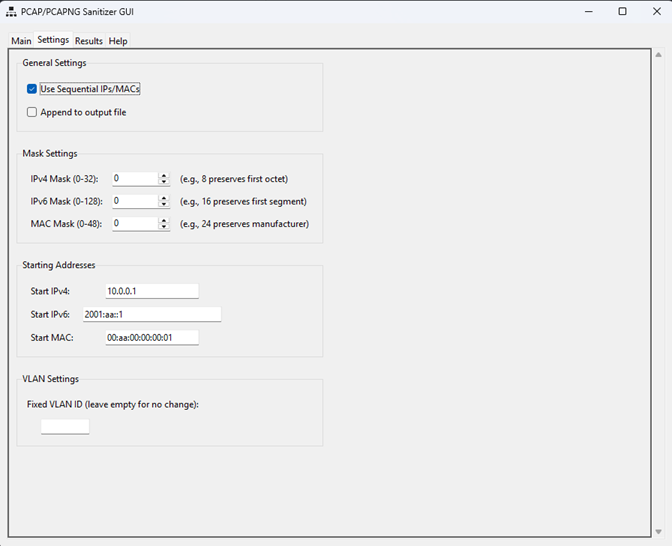
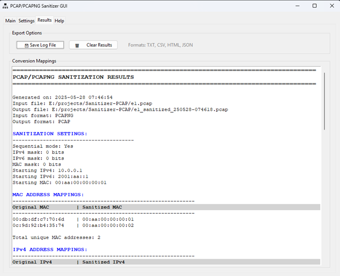
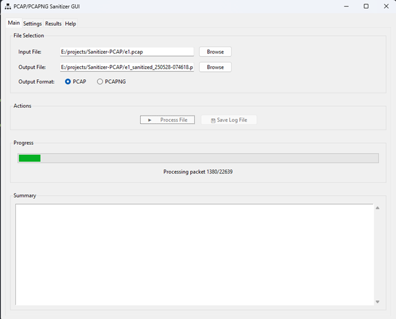

# PCAP/PCAPNG Sanitizer GUI

<p align="center">
  
  
  
</p>


## History

When you are a deep troubleshooter in computer networks, it is very common need to share some packet (PCAP/PCAPNG) captures with manufacturers and external providers to add some extra intelligence and brain muscle, if you are asking for help.


In my usual cybersecurity paranoia, is not easy for me to share internal IP addresses, VLAN information and MAC addresses to the outside world so, I drew inspiration from my old "Sanitizzer" program to create this Python version, with a lot of help from my new best friend, [Claude/Anthropic](https://claude.ai) LLM, who organized it, added comments, improved error handling, made it more modular and readable, and adhered to the Python PEP-8 programming standard.


## Introduction

A cross-platform GUI application for sanitizing PCAP and PCAPNG network capture files by anonymizing MAC addresses, IP addresses (IPv4/IPv6), and VLAN IDs while preserving the packet structure and flow patterns.

<p align="center">
  
  
  
  <br>
  <em>PCAP Sanitizer GUI in action</em>
</p>


## Features

- **🔒 Privacy Protection**: Anonymize sensitive network addresses while maintaining packet relationships
- **📁 Format Support**: Works with both PCAP and PCAPNG file formats
- **🎯 Selective Masking**: Preserve network structure with configurable bit masks
- **📊 Detailed Logging**: Export conversion mappings in multiple formats (TXT, CSV, HTML, JSON)
- **🖥️ Cross-Platform**: Runs on Windows 10/11, Linux, and macOS
- **🎨 User-Friendly GUI**: Intuitive interface with progress tracking and real-time updates

## Key Capabilities

<p align="center">
  
  <br>
  <em>PCAP Sanitizer GUI in action</em>
</p>

### Address Sanitization
- **MAC Addresses**: Replace hardware addresses while preserving vendor OUIs (optional)
- **IPv4 Addresses**: Anonymize IPs while maintaining subnet structures
- **IPv6 Addresses**: Full IPv6 support with configurable prefix preservation
- **VLAN IDs**: Optional VLAN tag replacement

### Sanitization Modes
- **Sequential Mode**: Predictable replacement for analysis (default)
- **Random Mode**: Enhanced privacy with randomized replacements

### Masking Options
- IPv4 mask (0-32 bits): Preserve network prefixes
- IPv6 mask (0-128 bits): Maintain IPv6 network structure
- MAC mask (0-48 bits): Keep vendor information if needed

## Installation

### Prerequisites

- Python 3.7 or higher
- pip (Python package installer)

### Required Dependencies

```bash
pip install -r requirements.txt
```

### Optional Dependencies

For better performance and full feature support:

```bash
# For improved PCAP performance
pip install pypcapfile

# For native PCAPNG support
pip install python-pcapng
```

### Platform-Specific Requirements

#### Windows
- Install [Npcap](https://npcap.com/) for packet capture support
- For PCAPNG conversion: Install [Wireshark](https://www.wireshark.org/) (includes editcap)

#### Linux
```bash
# Debian/Ubuntu
sudo apt-get install python3-tk wireshark-common

# Fedora/RHEL
sudo dnf install python3-tkinter wireshark-cli

# Arch
sudo pacman -S tk wireshark-cli
```

#### macOS
```bash
# Using Homebrew
brew install python-tk wireshark
```

## Usage

### Running the Application

```bash
python pcap_sanitizer_gui.py
```

### Quick Start

1. **Select Input File**: Click "Browse" to select your PCAP/PCAPNG file
2. **Configure Settings** (optional): 
   - Switch to Settings tab to adjust masks and starting addresses
   - Choose between Sequential or Random mode
3. **Process**: Click "Process File" to start sanitization
4. **Review Results**: Check the Results tab for conversion mappings
5. **Export Log**: Save the conversion log for future reference

### GUI Tabs

#### Main Tab
- File selection (input/output)
- Processing controls
- Progress monitoring
- Summary display

#### Settings Tab
- Sequential/Random mode toggle
- Address masks configuration
- Starting addresses for sequential mode
- VLAN replacement options

#### Results Tab
- Complete conversion mappings table
- Export options (TXT, CSV, HTML, JSON)
- Clear results functionality

#### Help Tab
- Built-in documentation
- Troubleshooting guide
- Feature explanations

## Examples

### Basic Usage
```bash
# Run the GUI
python pcap_sanitizer_gui.py
```

### Command Line Alternative
If you prefer command-line usage, the core sanitization functions can be used programmatically:

```python
from pcap_sanitizer_gui import sanitize

# Sanitize with default settings
sanitize('input.pcap', filepath_out='output_sanitized.pcap')

# Sanitize with custom settings
sanitize('input.pcap',
         filepath_out='output.pcap',
         sequential=True,
         ipv4_mask=8,      # Preserve first octet
         mac_mask=24,      # Preserve vendor OUI
         start_ipv4='10.0.0.1',
         start_mac='00:aa:00:00:00:01')
```

## Output Formats

### Log File Formats

1. **Text (.txt)**: Human-readable tables with ASCII formatting
2. **CSV (.csv)**: For spreadsheet analysis and data processing
3. **HTML (.html)**: Professional reports with styled tables
4. **JSON (.json)**: Machine-readable format for automation

### Sample Log Output
```
MAC ADDRESS MAPPINGS:
------------------------------------------------------------
Original MAC         | Sanitized MAC        
------------------------------------------------------------
aa:bb:cc:dd:ee:ff   | 00:aa:00:00:00:01   
11:22:33:44:55:66   | 00:aa:00:00:00:02   

IPv4 ADDRESS MAPPINGS:
------------------------------------------------------------
Original IPv4        | Sanitized IPv4       
------------------------------------------------------------
192.168.1.100       | 10.0.0.1            
192.168.1.200       | 10.0.0.2            
```

## Advanced Features

### Preserving Network Structure

Use masks to maintain network relationships:
- IPv4 mask of 8: Preserves Class A network (first octet)
- IPv4 mask of 16: Preserves Class B network (first two octets)
- IPv4 mask of 24: Preserves Class C network (first three octets)
- MAC mask of 24: Preserves vendor OUI (first three bytes)

### Handling Large Files

The application efficiently processes large PCAP files with:
- Streaming processing to minimize memory usage
- Progress bar for real-time status updates
- Threaded processing to maintain GUI responsiveness

## Troubleshooting

### Common Issues

1. **"No module named 'scapy'"**
   ```bash
   pip install scapy
   ```

2. **"No module named 'pcapng'"**
   ```bash
   pip install python-pcapng
   ```

3. **PCAPNG files not supported**
   - Install python-pcapng: `pip install python-pcapng`
   - Or install Wireshark for editcap conversion

4. **Permission errors on Linux**
   ```bash
   # Run with sudo or add user to wireshark group
   sudo usermod -a -G wireshark $USER
   ```

## Contributing

Contributions are welcome! Please feel free to submit a Pull Request. For major changes, please open an issue first to discuss what you would like to change.

### Development Setup

1. Clone the repository
   ```bash
   git clone https://github.com/yourusername/pcap-sanitizer-gui.git
   cd pcap-sanitizer-gui
   ```

2. Create a virtual environment
   ```bash
   python -m venv venv
   source venv/bin/activate  # On Windows: venv\Scripts\activate
   ```

3. Install dependencies
   ```bash
   pip install -r requirements.txt
   ```

## License

This project is licensed under the MIT License - see the [LICENSE](LICENSE) file for details.

## Acknowledgments

- Built with [Scapy](https://scapy.net/) for packet manipulation
- GUI powered by [Tkinter](https://docs.python.org/3/library/tkinter.html)
- Icon design included for easy identification

## Security Notice

This tool is designed for legitimate network analysis and privacy protection. Always ensure you have proper authorization before sanitizing network captures. The sanitization process is one-way - original addresses cannot be recovered without the log file.

## Support

For issues, questions, or contributions, please:
1. Check the [Issues](https://github.com/yourusername/pcap-sanitizer-gui/issues) page
2. Read the built-in Help documentation
3. Create a new issue with detailed information

---

Made with 🧠 and a lot of help from [Claude/Anthropic](https://claude.ai) for the network analysis community
